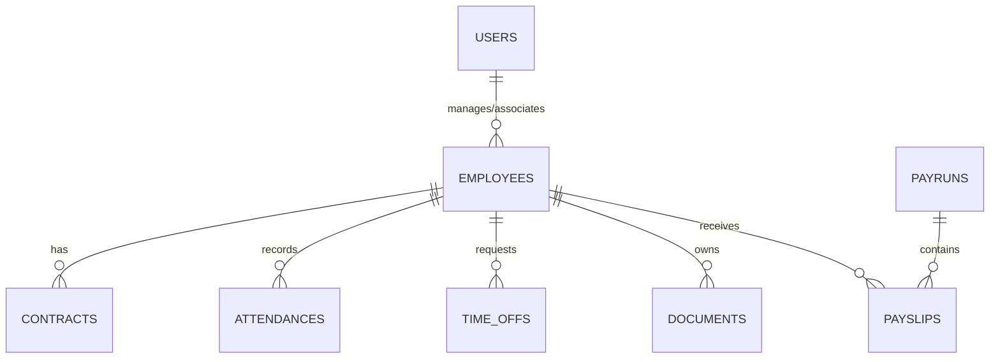

# Database Schema & Data Dictionary

## Entity Relational Diagram (ERD)

## Tables & Primary Keys
- **users** (`id`: UUID, `email`: VARCHAR, `role`: VARCHAR, `is_active`: BOOLEAN)
- **employees** (`id`: UUID, `user_id`: UUID, `first_name`: VARCHAR, `last_name`: VARCHAR, `department`: VARCHAR)
- **contracts** (`id`: UUID, `employee_id`: UUID, `salary`: NUMERIC, `start_date`: DATE, `status`: VARCHAR)
- **payruns** (`id`: UUID, `period_start`: DATE, `period_end`: DATE, `total_payout`: NUMERIC, `status`: VARCHAR)
- **payslips** (`id`: UUID, `payrun_id`: UUID, `employee_id`: UUID, `gross_pay`: NUMERIC, `net_pay`: NUMERIC)
- **time_offs** (`id`: UUID, `employee_id`: UUID, `type`: VARCHAR, `start_date`: DATE, `status`: VARCHAR)
